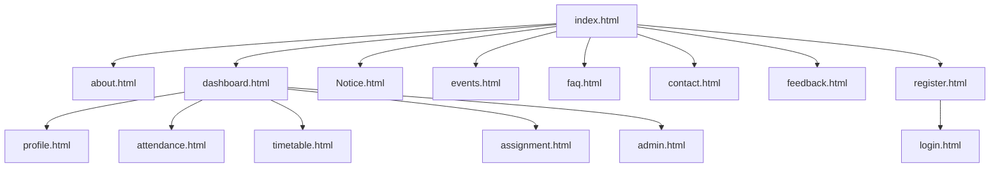
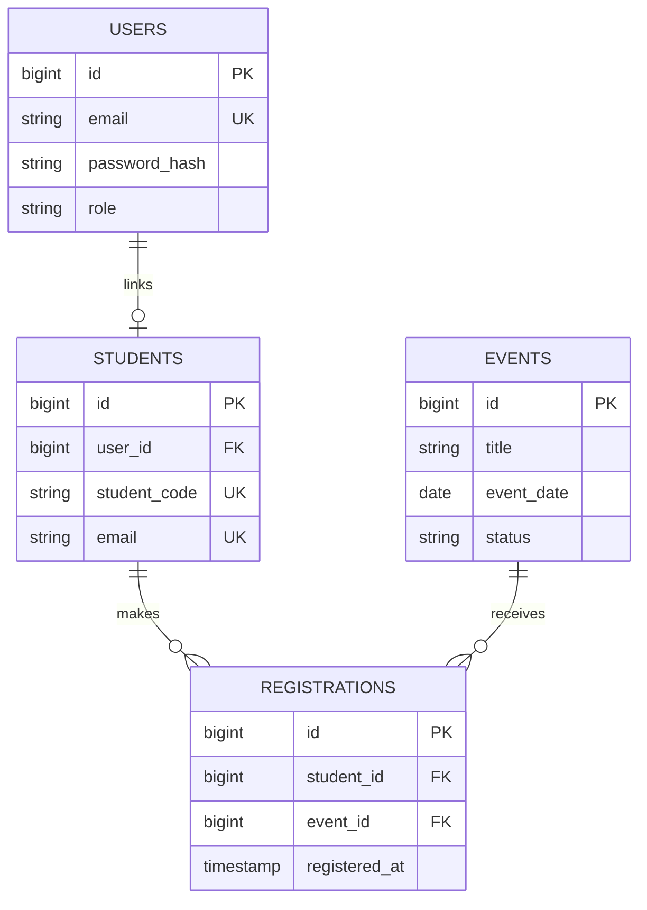

# StudentHub

StudentHub is a CHARUSAT student portal project for ITUE203 Web Development Frameworks. This project keeps the supplied StudentHub pages and campus images, and organizes the practical work into reusable styles, scripts, JSON sample data, and PHP/MySQL source.

## Project setup

1. Copy this folder into the XAMPP `htdocs` directory, for example `C:\xampp\htdocs\StudentHub`.
2. Start Apache. Open `http://localhost/StudentHub/` so JSON data is served over HTTP (the Fetch API does not work reliably from a `file://` URL).
3. The static pages, theme switch, event/FAQ JSON views, and validation work without a database.
4. For Practical 9, import `php/schema.sql` in MySQL/phpMyAdmin. Copy `php/config.local.php.example` to `php/config.local.php` and add local database credentials (or set the documented `STUDENTHUB_DB_*` Apache/PHP environment variables). The local config file is ignored by Git. Restart Apache after changing its environment.
5. Submit the registration form through Apache. With MySQL configured, the processor checks for an existing email and inserts the account with a `password_hash()` hash using prepared MySQLi statements. Without MySQL configuration, it demonstrates Practical 7 by storing profile fields in JSON and CSV under `php/storage/`; passwords are never written to those files. Apache denies direct web access to this folder.

## Pages and sitemap





The shared navigation and footer connect the public pages. Academic pages include the supplied Dashboard, Profile, Attendance, Timetable, Assignments, Notices and Admin screens.

## Requirements and practical coverage

- **1 — Planning:** The sitemap is above. Supplied low-fidelity references are `images/home-wireframe.png`, `images/events-wireframe.png`, `images/login-wireframe.png` and `images/wireframe.png`. The page inventory and folder layout in this README document scope and navigation. The archive includes its Git repository; make commits as each practical is completed and connect the repository to GitHub for submission.
- **2 — Semantic HTML and access:** Fifteen linked HTML pages use page landmarks, a shared skip link, labelled forms, descriptive image text, clear heading structure, keyboard focus styling and responsive navigation.
- **3 — Responsive UI:** `CSS/theme.css` supplies shared design tokens and mobile-first rules; the existing per-page styles remain in `CSS/` and are loaded before shared overrides. Grid and Flexbox are used for card, navigation and hero layouts.
- **4 — JavaScript:** `js/theme.js` remembers light/dark theme across pages and supports the mobile menu. `js/script.js` controls the home-page slider, dismissible announcement and accessible welcome dialog. The FAQ uses native expandable details.
- **5 — Registration UX:** `register.html` and `js/register.js` validate name, email, mobile, password strength, confirmation, course, year, gender and terms with inline messages. Server validation repeats the checks.
- **6 — JSON views:** `Data/events.json`, `Data/students.json` and `Data/faqs.json` contain sample records (at least 15 each). Events and FAQs load with Fetch, provide search/filter (events), sorting, pagination (events), and useful loading/error/empty states.
- **7 — PHP forms and file storage:** `php/register.php` and `php/contact.php` handle POST requests, repeat validation on the server, and return success/error messages to their forms. Registration profile records (without passwords) are stored as JSON and CSV; contact messages are stored as JSON. All submitted records are kept in the Apache-protected `php/storage/` directory.
- **8 — Database design:** `php/schema.sql` defines users, students, events and registrations, with primary/foreign keys and uniqueness constraints. `php/db.php` supplies a UTF-8 MySQLi connection from environment configuration.
- **9 — Secure registration:** The PHP processor checks duplicate email, uses a prepared insert, stores the `password_hash()` result in `users.password_hash`, and assigns new accounts the `student` role.

## Folder structure

```text
Studenthub/
├── index.html and other page HTML files
├── CSS/                 Page styles and shared theme
├── js/                  Shared and page-specific interactions
├── Data/                Public sample JSON for Fetch API views
├── images/              Supplied campus imagery and wireframes
└── php/
    ├── db.php           MySQLi connection helper
    ├── register.php     Validated registration and JSON/CSV storage
    ├── contact.php      Validated contact messages and JSON storage
    ├── schema.sql       MySQL schema
    └── storage/         Private Practical 7 JSON/CSV output
```

## Scope note

The practical list through task 9 asks for registration, data views, file storage and a secure database registration flow; later tasks such as sessions, CRUD, poster uploads and a dynamic database dashboard are outside this delivery. Theme controls, FAQ and the supplied portal screens are included throughout the current pages. Database-backed submission requires PHP/MySQL configured under XAMPP.
